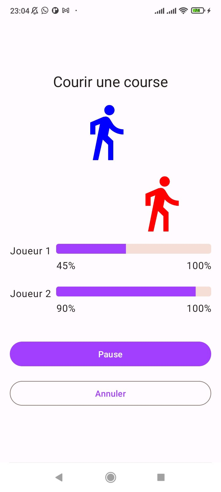

# Suivi de Course

Race Tracker est une application conçue pour simuler une course entre deux joueurs. Elle offre une opportunité d'expérimenter et d'apprendre davantage sur les différentes facettes des coroutines dans le développement Android.

## Aperçu de l'Application

L'application Race Tracker simule une course entre deux joueurs. Son interface utilisateur est composée des boutons Commencer/Mettre en pause et Réinitialiser, ainsi que de deux barres de progression indiquant la progression des coureurs. Le Joueur 1 et le Joueur 2 sont programmés pour courir à des vitesses différentes. Au début de la course, le Joueur 2 progresse deux fois plus vite que le Joueur 1.

## Implémentation Backend

Le backend de l'application Race Tracker gère la logique derrière la simulation de la course. Il utilise des coroutines pour gérer efficacement les tâches asynchrones. Le mécanisme des coroutines permet une exécution fluide des opérations concurrentes, telles que la mise à jour de la progression de chaque joueur pendant la course.

## Modification du Thème

- **Couleurs des Boutons :** Les couleurs des boutons ont été personnalisées pour offrir une expérience visuelle unique.

- **Icônes des Joueurs :** Les icônes des joueurs ont été doublées avec des couleurs différentes pour les distinguer plus facilement. Maintenant, le joueur 1 est représenté par une icône rouge, tandis que le joueur 2 est représenté par une icône bleue.

## Backend pour les Icônes

Les icônes des joueurs sont désormais gérées par un backend dédié. Cela permet d'avoir une meilleure gestion des ressources et de garantir la cohérence des icônes utilisées dans l'application.

Pour plus de détails sur l'implémentation du backend des icônes, veuillez consulter le code source du projet.

### Vidéo de démonstration

[Regarder la vidéo de démonstration sur YouTube](https://youtu.be/q6woQijFY0E)

